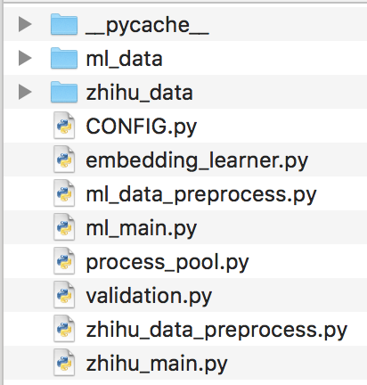

<!--
 * @Author: error: git config user.name && git config user.email & please set dead value or install git
 * @Date: 2022-12-01 18:28:20
 * @LastEditors: error: git config user.name && git config user.email & please set dead value or install git
 * @LastEditTime: 2022-12-02 15:37:01
 * @FilePath: \undefinedc:\Users\28332\Desktop\TSeqE\README.md
 * @Description: 
 * 
 * Copyright (c) 2022 by error: git config user.name && git config user.email & please set dead value or install git, All Rights Reserved. 
-->

# TSeqE 

This repo provides a reference implementation of **TSeqE** as described in the paper:

> J. Yang, W. Zhou, W. Qian, J. Han and S. Hu, "[Topic Sequence Embedding for User Identity Linkage from Heterogeneous Behavior Data](https://doi.org/10.1109/ICASSP39728.2021.9415111)," ICASSP 2021 - 2021 IEEE International Conference on Acoustics, Speech and Signal Processing (ICASSP), 2021, pp. 2590-2594.

## Basic Usage

## Code reference

- CONFIG.py：实验参数配置。
- embedding\_learner.py：话题表示学习模块，提供Embedding_Learner类，成员函数fit()为训练函数入口。
- zhihu/ml\_data\_preprocess.py：提供数据预处理功能。
- zhihu/ml\_main.py：实验入口程序，包含数据集分割、训练、测试。
- process_pool.py：多进程模块。
- validation.py：提供测试中的距离、准确率计算功能。

### Run the code

运行前需要将数据与代码组织成如下结构：
<center></center>

由于这是后期帮忙整理出的代码，没有全部跑过，不能保证跑通。

```shell
cd ./TSeq

# processing zhihu dataset information 
python zhihu_data_preprocess.py 

# run the model on zhihu_dataset 
python zhihu_main.py 

# processing MovieLens dataset information 
python ml_data_preprocess.py 

# run the model on MovieLens dataset 
python ml_main.py

```

## Datasets

the datasets could be found in the following links:

[TSeqE_data](https://drive.google.com/drive/folders/18CrFkfYGSb0LpwKcZmv3jkIfG-SqNbox?usp=sharing)


## Cite

If you find **TSeqE** useful for your research, please consider citing us :

    @INPROCEEDINGS{TSeqE,
        author={Yang, Jinzhu and Zhou, Wei and Qian, Wanhui and Han, Jizhong and Hu, Songlin},
        booktitle={ICASSP 2021 - 2021 IEEE International Conference on Acoustics, Speech and Signal Processing (ICASSP)}, 
        title={Topic Sequence Embedding for User Identity Linkage from     Heterogeneous Behavior Data}, 
        year={2021},
        volume={},
        number={},
        pages={2590-2594},
        doi={10.1109/ICASSP39728.2021.9415111}
    }
